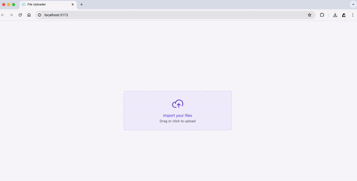

# File Uploader

File Uploader is a mini app for uploading file. You can select or drag multiple files from your computer to the upload zone, and then uploading the files.

The uploader component's UI is based on a challenge project [#boraCodar](https://www.rocketseat.com.br/boracodar). And as for file storage, I choose AWS S3.

### Features

- click upload zone to select multiple files
- drag multiple files from your computer to upload zone
- view uploading progress when uploading
- view what you have uploaded
